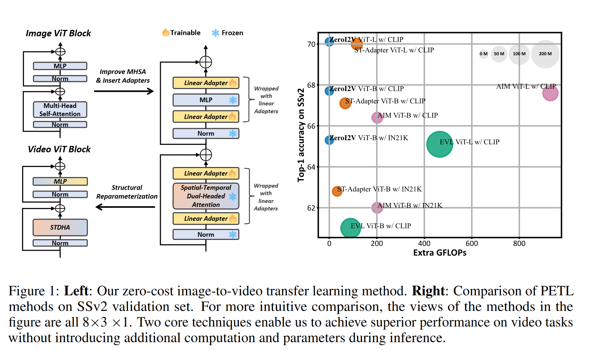

# ZeroI2V: Zero-Cost Adaptation of Pre-trained Transformers from Image to Video

This repo is the official implementation of ["ZeroI2V: Zero-Cost Adaptation of Pre-trained Transformers from Image to Video"](https://arxiv.org/abs/2310.01324) 

If you find our work useful in your research, please cite:
```
@article{li2023zeroi2v,
  title={ZeroI2V: Zero-Cost Adaptation of Pre-trained Transformers from Image to Video},
  author={Li, Xinhao and Wang, Limin},
  journal={arXiv preprint arXiv:2310.01324},
  year={2023}
}
```

We will publish our source codes and pretrained model weights after the review process.

## Introduction

In this paper, we present a zero-cost adaptation paradigm (ZeroI2V) to transfer the image transformers to video recognition tasks (i.e., introduce zero extra cost to the adapted models during inference).




## Models

### Kinetics 400

| Backbone |  Pretrain   | GFLOPs | Param | New Param (M) | acc@1 | Views | Checkpoint | Checkpoint before reparam |
| :---: | :---: | :---: | :---: | :---: | :---: | :---: | :---: | :---: |
| ViT-B/16 | CLIP | 422 | 86 | 0 | 83.0 | 8x1x3 | [checkpoint]() | [checkpoint]() |
| ViT-L/14 | CLIP | 7783 | 304 | 0 | 87.2 | 32x1x3 | [checkpoint]() | [checkpoint]() |

### Something Something V2

| Backbone |  Pretrain   | GFLOPs | Param | New Param (M) | acc@1 | Views | Checkpoint | Checkpoint before reparam |
| :---: | :---: | :---: | :---: | :---: | :---: | :---: | :---: |:---: |
| ViT-B/16 | CLIP |  422   | 86 | 0 | 67.7 | 8x3x1 | [checkpoint]() | [checkpoint]() |
| ViT-L/14 | CLIP | 7783 | 304 | 0 | 72.2 | 32x3x1 |[checkpoint]()| [checkpoint]() |

## Installation


```bash
pip install -U openmim
mim install mmengine 'mmcv>=2.0.0rc1'
mim install "mmdet>=3.0.0rc5"
mim install "mmpose>=1.0.0rc0"
git clone https://github.com/leexinhao/ZeroI2V.git
cd ZeroI2V
pip install -v -e .
# install CLIP
pip install git+https://github.com/openai/CLIP.git
```
Our project is based on [MMAction2](https://github.com/open-mmlab/mmaction2). Please refer to [install.md](https://mmaction2.readthedocs.io/en/1.x/get_started.html) for more detailed instructions.

## Data Preparation

All the datasets ([K400](https://github.com/open-mmlab/mmaction2/blob/master/tools/data/kinetics/README.md), [SSv2](https://github.com/open-mmlab/mmaction2/blob/master/tools/data/sthv2/README.md), [UCF101](https://github.com/open-mmlab/mmaction2/blob/main/tools/data/ucf101/README.md) and [HMDB51](https://github.com/open-mmlab/mmaction2/blob/main/tools/data/hmdb51/README.md)) used in this work are supported in [MMAction2](https://github.com/open-mmlab/mmaction2).

## Training

The training configs of different experiments are provided in `configs/recognition/`. To run experiments, please use the following command. `PATH/TO/CONFIG` is the training config you want to use. The default training setting is 8GPU with a batchsize of 64.

```shell
bash tools/dist_train.sh <PATH/TO/CONFIG> <NUM_GPU>
```

We also provide a training script in `run_exp.sh`. You can simply change the training config to train different models.

## Evaluation

The code will do the evaluation after training. If you would like to evaluate a model only, please use the following command,

```shell
bash tools/dist_test.sh <PATH/TO/CONFIG> <CHECKPOINT_FILE> <NUM_GPU> --eval top_k_accuracy
```
## Reparameterize the linear adapter

Please refer to `tools\weight_reparam.py`.
## Test speed and throughput

Please refer to `tools\test_speed.py` and `tools\test_throughput.py`.
## TODO
- [x] Release a part of source codes
- [ ] Release source codes 
- [ ] Pretrained model weights


